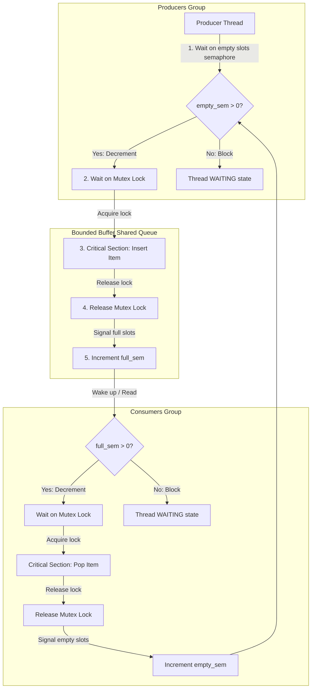

# Smart Factory: Producer–Consumer Synchronization Simulator

A high-performance, multithreaded desktop application designed to visualize and teach core Operating System (OS) concurrency concepts. This simulator models a **Smart Factory conveyor belt system** using classic synchronization primitives (**Mutex Locks** and **Semaphores**) to solve the **Producer–Consumer (Bounded Buffer) problem**.

Built with a premium PyQt6-based dashboard, this interactive program visualizes real-time thread scheduling, queue contention, deadlocks, and thread starvation while logging telemetry data to an SQLite database and generating executive PDF analysis reports.

---

## Key Features

*   **Real-time Concurrency Visualizations**:
    *   **Custom Conveyor Canvas**: Visually tracks items generated by Producers, traveling down the conveyor belt, and retrieved by Consumers.
    *   **State Monitors**: Displays real-time states for each thread (Running, Blocked on Mutex, Waiting on Semaphore, Sleeping).
    *   **Synchronization Primitive Telemetry**: Real-time counters showing Mutex Ownership, Empty Slot Semaphores, and Full Slot Semaphores.
*   **Interactive Controls**:
    *   Add/remove Producer and Consumer threads dynamically at runtime.
    *   Adjust production and consumption delay speeds individually.
    *   Scale simulation tick speed with speed multipliers ($0.5\times$, $1\times$, $2\times$, etc.).
*   **Stress Testing Utility Module**:
    *   Inject dynamic burst loads to saturate empty slots.
    *   Simulate random worker/thread crashes to observe system behavior.
    *   Instantly force the Bounded Buffer to be completely Full or Empty.
*   **Diagnostic & OS Educational Advisor**:
    *   **Live Explainer Panel**: Decodes OS synchronization mechanisms as they happen (e.g., explaining why a consumer is waiting on an empty queue).
    *   **AI Advisor Recommendation System**: Analyzes live throughput metrics and recommends structural adjustments (e.g., suggesting dynamic buffer resizing or worker thread scaling to clear queue bottlenecking).
*   **Database & Simulation Replay**:
    *   Telemetrics logged directly into an **SQLite database** (`simulation_data.db`).
    *   **Session Playback**: Save runs and replay them frame-by-frame with full visual feedback at customized playback speeds.
*   **Executive PDF Report Generator**:
    *   Exports professional, styled PDF executive summaries containing simulation run statistics, threat level evaluations, and custom optimization advice via ReportLab.
*   **Premium Dynamic Themes**:
    *   Includes 5 styled themes with customized CSS (QSS stylesheets): *Dark Mode*, *Light Mode*, *Cyber Theme*, *Factory Theme*, and *Professional Theme*.

---

## Concurrency & Synchronization Architecture

The simulator replicates the classic **Bounded Buffer synchronization pattern** inside `sync_engine.py` using Python's native `threading` module wrapped with diagnostic hooks.

### The Producer-Consumer Synchronization Flow Chart



### Core Code Snippet (`sync_engine.py`)

Here is how the Bounded Buffer guarantees race-free operation:

```python
def put(self, item, producer_id):
    # 1. Block if buffer capacity is full
    self.empty_sem.acquire(producer_id)
    
    # 2. Acquire mutual exclusion (Mutex) to access shared memory
    self.mutex.acquire(producer_id)
    
    # Critical Section: Append item to queue safely
    with self.items_lock:
        self.items.append(item)
    self.tracker.log_production(producer_id, item)
    
    # 3. Release Mutex
    self.mutex.release()
    
    # 4. Signal full slot (Unblock waiting Consumers)
    self.full_sem.release()
```

---

## Database Schema (`simulation_data.db`)

The SQLite database uses four tables linked via cascading foreign keys to store history and frame-by-frame data:

```
┌─────────────────────────────────┐
│           simulations           │
├─────────────────────────────────┤
│ id (PK)                         │
│ timestamp (TEXT)                │
│ duration (REAL)                 │
│ producers (INTEGER)             │
│ consumers (INTEGER)             │
│ buffer_capacity (INTEGER)       │
│ production_rate / consumption   │
│ item_type / theme (TEXT)        │
└────────────────┬────────────────┘
                 │ 1:N (Cascaded)
        ┌────────┴────────┬────────────────────────┐
        ▼                 ▼                        ▼
┌───────────────┐ ┌──────────────┐         ┌───────────────┐
│    events     │ │  statistics  │         │  replay_data  │
├───────────────┤ ├──────────────┤         ├───────────────┤
│ id (PK)       │ │ id (PK)      │         │ id (PK)       │
│ simulation_id │ │ simulation_id│         │ simulation_id │
│ relative_time │ │ total_produced│        │ sequence_order│
│ thread_type   │ │ total_consumed│        │ state_snapshot│
│ thread_id     │ │ avg_wait_time│         │ (JSON String) │
│ event_type    │ │ block_counts │         └───────────────┘
│ details       │ └──────────────┘
└───────────────┘
```

---

## Directory Structure

```
├── main.py                 # Application Entrypoint & Signal Handlers
├── SmartFactorySimulator.exe # Compiled Standalone Executable
├── SmartFactorySimulator.spec # PyInstaller specification file
├── core/                   # Core Simulation Backend Modules
│   ├── __init__.py         # Package initialization
│   ├── consumer.py         # Consumer thread worker loop logic
│   ├── producer.py         # Producer thread worker loop logic
│   ├── controller.py       # Simulation life-cycle & stress-test controller
│   ├── sync_engine.py      # Mutex/Semaphore Wrappers & Bounded Buffer Logic
│   ├── state_tracker.py    # Centralized Simulation telemetry state registry
│   ├── database.py         # SQLite ORM Database logging & replay logic
│   ├── pdf_generator.py    # ReportLab Executive PDF report builder
│   ├── theme_manager.py    # Application-wide themes and stylesheets
│   └── test_sync.py        # Headless stress and race condition tests
└── ui/                     # UI Panel Modules (PyQt6)
    ├── __init__.py         # Package initialization
    ├── main_window.py      # Master layout window composition
    ├── conveyor_widget.py  # Paint canvas animation for Conveyor Belt items
    ├── control_panel.py    # Runtime configuration and stress triggers
    ├── sync_monitor.py     # Blocked threads and locking metrics overview
    ├── analytics_panel.py  # PyQtGraph live line & bar charts
    ├── log_panel.py        # Live Console event circular logger buffer panel
    ├── edu_panel.py        # OS Scheduling Explainer Card
    ├── ai_advisor.py       # Local Rule-based Optimization Engine
    └── inspector_dialog.py # Inspects selected thread queue history
```

---

## Installation & Usage

### Prerequisites
Make sure you have **Python 3.10** or higher installed.

### 1. Clone & Set Up Workspace
```bash
git clone https://github.com/AakifCodes/Producer-Consumer-Problem-Visualization.git
cd Producer-Consumer-Problem-Visualization
```

### 2. Install Dependencies
Install the required packages using pip:
```bash
pip install PyQt6 pyqtgraph reportlab
```

### 3. Run the Simulation Dashboard
Run the primary script to start the GUI application:
```bash
python main.py
```

### 4. Running the Tests
To verify race conditions and transaction integrity under load without booting up the GUI:
```bash
python core/test_sync.py
```


---

## 💡 How to Interact with the Simulator

1.  **Configure Parameters**: Select the number of producers/consumers, the conveyor belt capacity, and task delay speeds in the bottom **Control Center**.
2.  **Toggle Themes**: Use the dropdown in the control panel to change colors instantly (e.g., Cyberpunk Theme or Factory Theme).
3.  **Perform Stress Tests**:
    *   Click **Force Full** or **Force Empty** to see semaphores peg to limit values.
    *   Click **Burst Load** to saturate the buffer.
    *   Click **Simulate Crash** to watch thread starvation occur as consumer counts fall behind.
4.  **Save & Replay**:
    *   Runs are recorded automatically.
    *   Go to **Replay Database** in the top menu bar to load a previous simulation session and step through it.
5.  **Generate Report**: Click **Export PDF Report** to save a detailed analysis of your simulation run.
